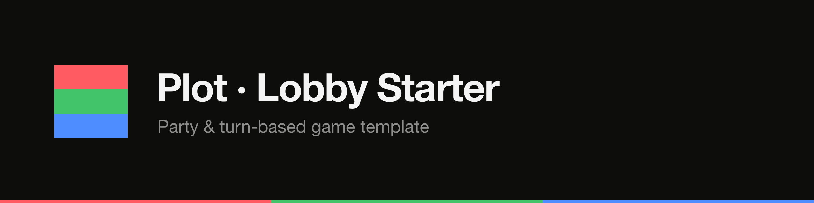

<p align="center"><a href="https://plot.ws"></a></p>

<p align="center">
  <a href="./LICENSE"></a>
  <a href="https://docs.plot.ws"></a>
  <a href="https://discord.gg/plot"></a>
  <a href="https://github.com/plot-ws/plot-lobby-starter/actions/workflows/ci.yml"></a>
  <a href="./CONTRIBUTING.md"></a>
</p>

# Plot lobby starter

A minimal, fully-working boilerplate for **lobby-based multiplayer** on
[Plot](https://plot.ws): join by **room code**, see who's **present**, play a
series of **rounds**, and rank everyone on a **scoreboard** at the end.

Clone it and you have the bones every party game (Jackbox, skribbl, trivia) and
every turn-based game shares — because both are really the same thing: a
**lobby + rounds + scoreboard**. The one round bundled here is deliberately
trivial — "closest guess": each round picks a secret number 1–100, everyone
guesses, the closest guess wins the round's points. Swap that round for your own
game and keep the engine.

## What's in here

```
src/
  logic.ts        Pure engine: State, pickTarget, closestPlayer, advance, ranking (no I/O)
  logic.test.ts   Vitest unit tests for the pure engine
  handler.ts      Authoritative @plot/handler room (the round state machine)
  main.ts         Thin DOM client — a view over room.currentState
  lobby.css       Minimal styling
index.html        #app mount
```

The split is the whole point:

- **`handler.ts` is the state machine.** It runs server-side at 5 ticks/sec,
  owns `ctx.state`, and decides every transition (lobby → round → intermission →
  over) by delegating to the pure reducers in `logic.ts`. Timing is counted in
  *ticks* (`state.tick` vs `state.deadlineTick`), never wall-clock, so it's
  deterministic.
- **`main.ts` is a thin view.** It never decides game rules. It polls
  `room.currentState`, renders the current phase, and sends player intents
  (`setName` / `start` / `guess`) on the `event` channel.

## Run it

```bash
npm install
npm run dev
```

Then open the printed URL in **two browser tabs** (each tab is a player) or
share the room code with a friend. Append `?room=YOURCODE` to the URL to pick a
room; otherwise everyone lands in `LOBBY1`.

### Connecting to Plot

Set your app key (create an app at <https://plot.ws>) via a `.env.local` file:

```ini
VITE_PLOT_APP_KEY=your_app_key_here
# Optional: point at a local/self-hosted Plot instead of the hosted API.
VITE_PLOT_API_URL=http://localhost:8787
```

Both are read in `src/main.ts`. With no key set it falls back to `demo`, which
is enough to typecheck/build/test offline.

## Verify

```bash
npm run typecheck   # tsc --noEmit
npm run build       # vite build
npm test            # vitest run
```

## Extend this

The engine is `lobby → round → intermission → over`. To build your game, replace
just the **round** — the rest stays:

- **Party (Jackbox / skribbl):** make the round a *prompt → submit → vote* flow
  (drawings, captions, answers). Tally votes in `advance` instead of distance.
- **Trivia:** the round is a question; score the first/most-correct answers.
- **Turn-based (board / card game):** add a `turnOrder: string[]` and
  `activeIdx` to `State`, accept a `move` message only from the active player in
  `handler.ts`, and rotate the index. A turn is just a round with one actor.
- **More rounds, longer timers, more points:** tune the constants at the top of
  `logic.ts` (`MAX_ROUNDS`, `ROUND_SECONDS`, `ROUND_POINTS`).

Because `logic.ts` is pure, every rule you add is unit-testable without a
network — see `logic.test.ts` for the pattern.

## The vendored `@plot` packages

`@plot/client` and `@plot/handler` are vendored under `vendor/` and wired as
`file:` dependencies so this starter runs offline. Once the packages are
published, replace the `file:` entries in `package.json` with normal versions:

```bash
npm install @plot/client @plot/handler
```

…and delete the `vendor/` directory.

## Deploy

- **Client:** `npm run build` emits a static `dist/` — host it on any static
  host (Cloudflare Pages, Netlify, GitHub Pages, an S3 bucket, …).
- **Handler:** `handler.ts` is your authoritative room. Deploy it to Plot and
  point `VITE_PLOT_APP_KEY` at the matching app. See the Plot docs at
  <https://plot.ws> for the deploy command for your account.

## License

MIT — see [LICENSE](./LICENSE).
